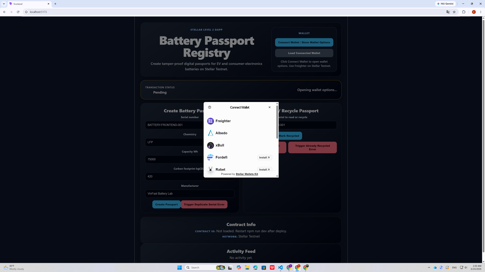
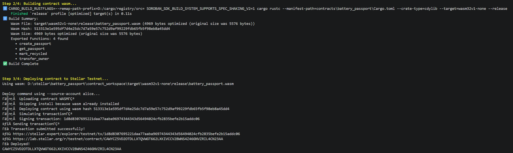
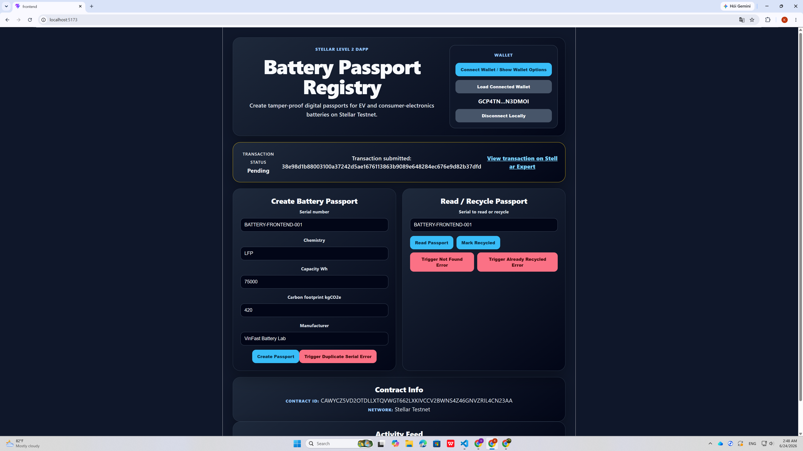
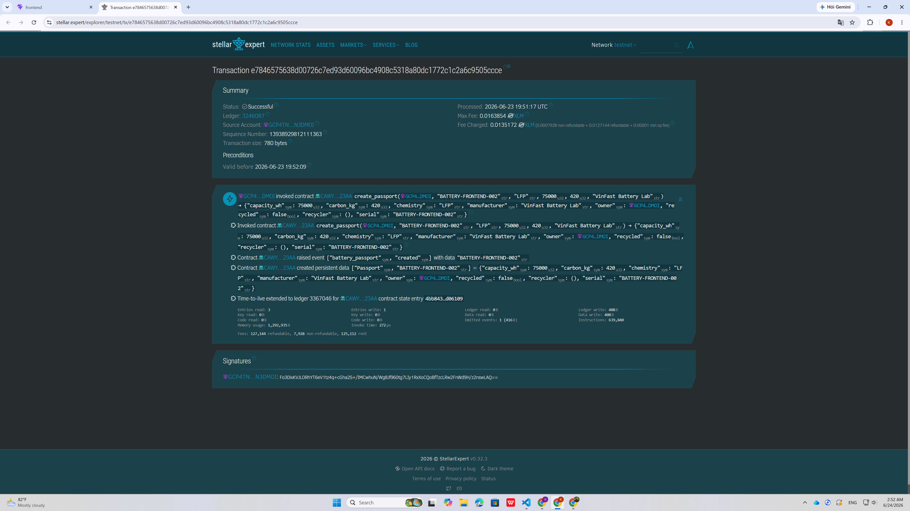
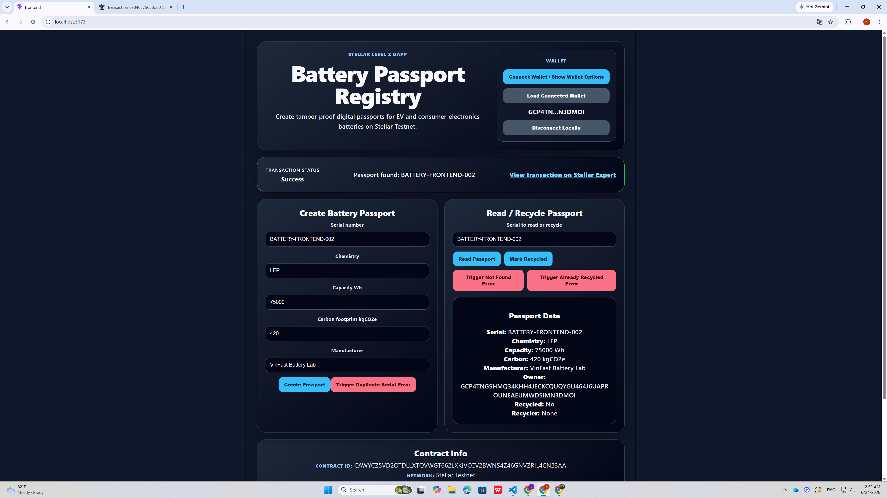
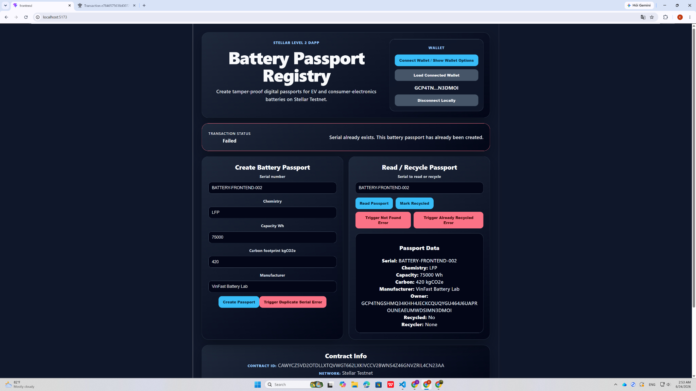
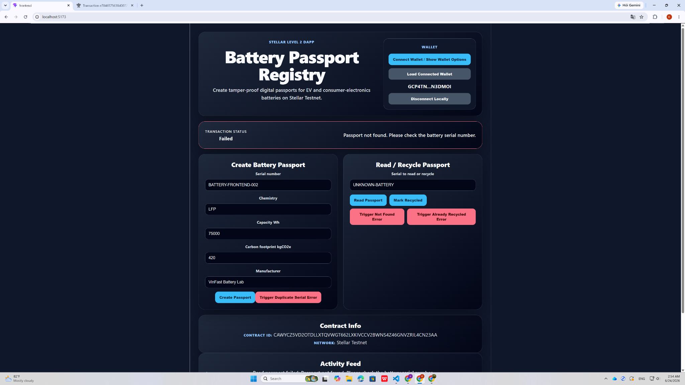

# Battery Passport Registry

Battery Passport Registry is a Stellar Level 2 dApp built with a Soroban smart contract and a React frontend.

The project creates tamper-proof digital passports for EV and consumer-electronics batteries. Each battery passport stores important lifecycle data such as serial number, chemistry, capacity, embedded carbon footprint, manufacturer, current owner, and recycling status.

This project demonstrates:

* Smart contract deployment on Stellar Testnet
* Frontend contract interaction
* Wallet connection using Stellar wallet options
* Transaction status tracking
* Contract call transaction hash
* Error handling for multiple contract errors

---

## Project Overview

### Problem

Battery supply chains are difficult to audit. Manufacturers, second-life buyers, recyclers, regulators, and consumers need a reliable way to verify battery origin, metadata, ownership, and recycling status.

### Solution

Battery Passport Registry stores battery metadata on Stellar Testnet through a Soroban smart contract. A user can connect a Stellar wallet, create a battery passport, read passport data, and mark a battery as recycled.

### Core Features

* Create a new battery passport
* Read battery passport data by serial number
* Mark a battery as recycled
* Display transaction status on frontend
* Display contract call transaction hash
* Handle contract errors in the UI
* Use Stellar wallet options for wallet connection

---

## Tech Stack

### Smart Contract

* Rust
* Soroban SDK
* Stellar CLI
* Stellar Testnet

### Frontend

* React
* TypeScript
* Vite
* Stellar SDK
* Stellar Wallets Kit

---

## Contract Information

### Network

```text
Stellar Testnet
```

### Deployed Contract Address

```text
CAWYCZ5VD2OTDLLXTQVWGT662LXKIVCCV2BWNS4Z46GNVZRIL4CN23AA
```

### Frontend Contract Call Transaction Hash

```text
PASTE_YOUR_FRONTEND_CREATE_PASSPORT_TX_HASH_HERE
```

### Stellar Expert Transaction Link

```text
https://stellar.expert/explorer/testnet/tx/e7846575638d00726c7ed93d60096bc4908c5318a80dc1772c1c2a6c9505ccce
```

---

## Smart Contract Functions

### `create_passport`

Creates a new battery passport.

Stored data:

* Serial number
* Chemistry
* Capacity in Wh
* Carbon footprint in kgCO2e
* Manufacturer
* Owner address
* Recycling status
* Recycler address

### `get_passport`

Reads battery passport data by serial number.

### `transfer_owner`

Transfers ownership of a battery passport to another wallet address.

### `mark_recycled`

Marks a battery as recycled and records the recycler address.

---

## Error Handling

The smart contract handles the following error types:

| Error                 | Code | Meaning                                           |
| --------------------- | ---: | ------------------------------------------------- |
| `SerialAlreadyExists` | `#1` | A passport with this serial number already exists |
| `PassportNotFound`    | `#2` | No passport exists for the provided serial number |
| `AlreadyRecycled`     | `#3` | The battery has already been marked as recycled   |
| `Unauthorized`        | `#4` | Only the current owner can update the passport    |

The frontend maps these contract errors into user-friendly messages.

---

## Screenshots

### 1. Wallet Options

The frontend shows wallet options before connecting a wallet.



---

### 2. Contract Deployed on Stellar Testnet

The smart contract was deployed successfully on Stellar Testnet.



---

### 3. Frontend Contract Call Success + Transaction Hash

The frontend calls the deployed contract and displays transaction status and transaction hash.



---

### 4. Transaction Verifiable on Stellar Expert

The contract call transaction can be verified on Stellar Expert.



---

### 5. Read Passport Data

The frontend reads battery passport data from the deployed smart contract.



---

### 6. Error: Duplicate Serial

The frontend handles the `SerialAlreadyExists` contract error.



---

### 7. Error: Passport Not Found

The frontend handles the `PassportNotFound` contract error.



---

### 8. Additional Passport Not Found Screenshot

This screenshot shows the repeated `PassportNotFound` error state.


---

## Local Setup

### Prerequisites

Install the following tools:

* Node.js
* npm
* Rust
* Stellar CLI
* Freighter Wallet

---

## Run Smart Contract Tests

From the project root:

```powershell
cd D:\stellar\battery_passport\contract_workspace
cargo test
```

Expected result:

```text
test result: ok. 6 passed; 0 failed
```

---

## Build Smart Contract

```powershell
cd D:\stellar\battery_passport\contract_workspace
stellar contract build
```

Expected result:

```text
Build Complete
```

---

## Deploy Smart Contract

This project includes a deploy script that automatically:

* Runs contract tests
* Builds the contract
* Deploys to Stellar Testnet
* Saves the new Contract ID into `CONTRACT_ID.txt`
* Updates frontend config in `frontend/src/contractConfig.ts`

Run:

```powershell
cd D:\stellar\battery_passport
.\scripts\deploy-and-save.ps1
```

---

## Run Frontend

```powershell
cd D:\stellar\battery_passport\frontend
npm install
npm run dev
```

Open:

```text
http://localhost:5173
```

---

## Frontend Testing Flow

1. Open the dApp at `http://localhost:5173`
2. Click `Connect Wallet / Show Wallet Options`
3. Select Freighter on Stellar Testnet
4. Click `Load Connected Wallet`
5. Create a battery passport
6. Confirm the transaction in the wallet
7. Wait for `Transaction Status: Success`
8. Open the Stellar Expert transaction link
9. Read the passport data
10. Trigger error states from the UI

---

## Level 2 Checklist

* [x] Smart contract deployed on Stellar Testnet
* [x] Frontend calls deployed contract
* [x] Transaction status visible on frontend
* [x] Contract call transaction hash shown
* [x] Transaction verifiable on Stellar Expert
* [x] Wallet options screenshot included
* [x] 3+ contract errors implemented
* [x] Smart contract tests included
* [x] React frontend included
* [x] README includes setup and evidence

---

## Project Structure

```text
battery_passport
├── contract_workspace
│   └── contracts
│       └── battery_passport
│           └── src
│               ├── lib.rs
│               └── test.rs
├── frontend
│   └── src
│       ├── App.tsx
│       ├── App.css
│       └── contractConfig.ts
├── scripts
│   └── deploy-and-save.ps1
├── screenshots
│   ├── contract-deployed.png
│   ├── error-duplicate-serial.png
│   ├── error-passport-not-found-repeat.png
│   ├── error-passport-not-found.png
│   ├── frontend-create-success-txhash.png
│   ├── read-passport-data.png
│   ├── stellar-expert-success.png
│   └── wallet-options.png
├── CONTRACT_ID.txt
└── README.md
```

---

## Notes

This project is built for Stellar Testnet and educational purposes. The frontend uses a deployed Soroban smart contract and allows users to interact with battery passport data through a wallet-connected UI.

The project aligns with real-world traceability use cases such as EV battery lifecycle tracking, second-life battery markets, recycling verification, and public auditability.
